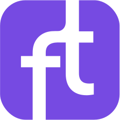

<p align="center">
  
</p>

<h1 align="center">Frontier Tower — Referral OS</h1>

<p align="center">
  <strong>The referral engine for the Vertical Village.</strong><br/>
  A guest-to-member referral platform built on the <a href="https://frontiertower.io">Frontier Tower</a> SDK — connecting guests with community members for tours, office visits, and membership onboarding.
</p>

<p align="center">
  
  
  
</p>

---

## What It Does

Frontier Tower is a 16-floor vertical village in San Francisco — home to builders working on AI, biotech, robotics, crypto, and more. This app powers a **community-driven referral program** where existing members host and onboard new guests, earning token rewards for every completed visit.

### The Flow

```
Guest submits request → Member accepts from queue → Visit happens → QR scan completes it → Rewards paid out
```

**For Guests:**
- Choose a visit type: **Tour**, **Office**, or **Membership**
- Select specific floors or offices you're interested in
- Set your availability with time slots
- Get a QR code to bring to your visit
- Track your request status in real-time

**For Members:**
- Browse the open request queue with filters
- Accept a time slot, propose a different one, or pass
- Scan the guest's QR code after the visit to mark it complete
- Earn **iFND** token rewards per completed referral
- Climb the leaderboard: **Helper** (5) → **Ambassador** (15) → **Champion** (30)

---

## Features

| Feature | Description |
|---|---|
| **Splash Screen** | Branded landing with "I'm a Guest" / "I'm a Member" routing |
| **Smart Guest Form** | Type-gated collapsible sections — floors, offices, personal info, availability |
| **QR Code Generation** | Unique code per request for scan-to-complete flow |
| **Status Lookup** | Guests enter their code to see a live progress timeline |
| **Member Queue** | Filterable request feed with accept/propose/decline actions |
| **Scan & Complete** | Camera-based QR scanning with manual code fallback |
| **Celebration Animation** | Confetti burst + animated reward counter on completion |
| **Leaderboard** | Ranked member list with badge tiers and completion stats |
| **Token Rewards** | iFND payouts via Frontier SDK wallet integration |

---

## The Tower

The app covers all 16 floors of Frontier Tower:

| Floor | Focus |
|---|---|
| Ground | Entrance |
| Mezzanine | Co-Living |
| 2 | Events & Hackathons |
| 3 | Private Offices |
| 4 | Robotics & Hard Tech |
| 5 | Movement & Fitness |
| 6 | Arts & Music |
| 7 | Maker Space |
| 8 | Neuro & Biotech |
| 9 | AI & Autonomous Systems |
| 10 | Frontier Accelerator |
| 11 | Health & Longevity |
| 12 | Ethereum & Decentralized Tech |
| 14 | Human Flourishing |
| 15 | Coworking & Library |
| 16 | d/acc Lounge |

---

## Tech Stack

- **TypeScript** — Type-safe codebase, zero `any`
- **Vite** — Fast dev server + production builds
- **Frontier SDK** (`@frontiertower/frontier-sdk`) — Auth, wallet, storage, payouts
- **QRCode** — Client-side QR generation
- **BarcodeDetector API** — Native browser QR scanning
- **Pure CSS** — No framework, custom design system with CSS variables
- **Hash Router** — Client-side routing with parameterized routes

### Design System

The UI is built on a custom design system inspired by [Controlled Chaos](https://github.com/RayyanZahid/controlledchaos) — an award-level CSS token system with:

- **5 typographic voices** — Outfit (display), Plus Jakarta Sans (body), Space Mono (data), Space Grotesk (accent), DM Sans (expressive)
- **Motion system** — Scroll reveals, stagger animations, celebration confetti
- **Force framework** — Configurable tension axes for structure, density, warmth, motion, volume
- **Brand-matched palette** — Colors pulled directly from [frontiertower.io](https://frontiertower.io)

---

## Getting Started

```bash
# Install dependencies
npm install

# Start dev server
npm run dev

# Production build
npm run build
```

The app runs in **dev mode** when outside the Frontier app context — mock user, wallet, and sample data are automatically provided.

### Dev Mode Defaults

| | Value |
|---|---|
| User | Dev User |
| Wallet | `0xDEV...001` |
| Balance | $250.00 |
| Sample Requests | 4 (Sarah Chen, Marcus Rivera, Aisha Patel, Jake Morrison) |

---

## Project Structure

```
src/
├── main.ts              # Boot, routes, SDK init
├── router.ts            # Hash-based client router
├── state.ts             # Reactive state container
├── types.ts             # TypeScript types, tower floors, office options
├── sdk.ts               # Frontier SDK wrapper + dev mode fallback
├── utils.ts             # Formatting, badges, time helpers
├── components/
│   ├── nav-bar.ts       # Bottom navigation with mode toggle
│   ├── modal.ts         # Bottom sheet modal system
│   └── toast.ts         # Toast notifications
├── views/
│   ├── splash.ts        # Landing page
│   ├── guest-form.ts    # Guest request form
│   ├── guest-success.ts # QR code + confirmation
│   ├── guest-status.ts  # Status lookup with timeline
│   ├── member-queue.ts  # Request queue + filters
│   ├── request-detail.ts# Accept/propose/decline
│   ├── my-accepted.ts   # Member's active requests
│   ├── scan-complete.ts # QR scan + celebration
│   └── leaderboard.ts   # Member rankings
└── styles/
    ├── global.css       # Theme, typography, base styles
    └── components.css   # Component library
```

---

## Badge Progression

| Badge | Requirement | Icon |
|---|---|---|
| Helper | 5 completed visits | 🌟 |
| Ambassador | 15 completed visits | ⭐ |
| Champion | 30 completed visits | 🏆 |

---

## Built For

**Frontier Tower Hackathon** — San Francisco, 2026

Built by [@cosmicemporium](https://github.com/cosmicemporium)

---

<p align="center">
  
</p>
